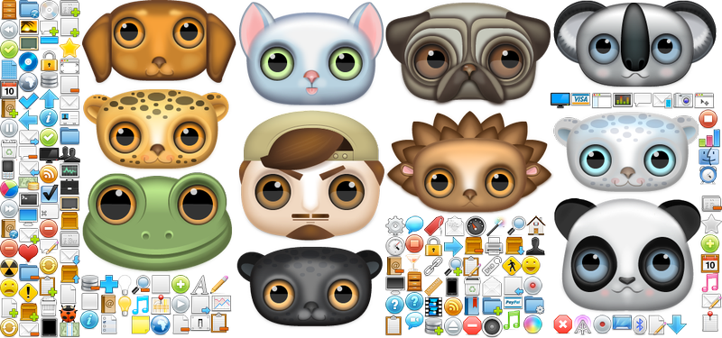

Texturer
========
Texture Map Generator in **TypeScript** _(MIT License)_

[](https://github.com/ibezkrovnyi/texturer)
[](https://www.npmjs.com/package/texturer "Texturer on NPM")
[](LICENSE)

**images/textureMap0.png**



**texturePool.ts** (TypeScript template result. See all [templates](templates) or create your [own (custom) template](#own-custom-template))
```typescript
namespace Game {

	// Statistics:
	// - textures: 244
	// - textureMaps: 8

	const maps = [
		{
			url     : "images/textureMap0.png",
			width   : 1664,
			height  : 512,
			repeatX : false,
			repeatY : false
		}
	];

	export var texturePool = {
		"star"  : { map : maps[ 0 ], x : 256, y : 384, width : 128, height : 128, opaque : false, trim : { left : 0, right : 0, top : 0, bottom : 0 } },
		"music" : { map : maps[ 0 ], x : 384, y : 384, width : 128, height : 128, opaque : false, trim : { left : 0, right : 0, top : 0, bottom : 0 } }
	};
}
```

Introduction
============
Texture Map Generator in pure JavaScript (TypeScript/NodeJS/Multi-threading) is image processing tool.
* generates texture map images for image sets.
* generates javascript/typescript/css texture map description file using *handlebars* templates
* able to copy whole directory without processing, however width/height and other info will be written into texture map description file

How To Install
==========================

### from NPM (https://www.npmjs.com/package/texturer)

Install this module locally(into your project only) with the following command:
```shell
npm install texturer
```

Install this module globally with the following command:
```shell
npm install texturer -g
```

### from GitHub (https://github.com/ibezkrovnyi/texturer) 

```shell
git clone https://github.com/ibezkrovnyi/texturer
cd texturer
npm install
npm run build
```

> to clean-up project run `npm run clean`

Usage
=====

Run in folder with config.json (see [example](example) folder)
```shell
texturer
```

Process specified configuration file
```shell
texturer example/app/resources/config.json
```

Usage from Code
===============
```js
var Texturer   = require("<path to texturer src/index.js>"),
	config     = JSON.parse(require("fs").readFileSync("./config.json", "utf8"));

new Texturer().generate(config, function (error) {
	if (error) {
		console.trace("\x1B[91m" + error + "\x1B[39m");
		process.exit(42);
	} else {
		process.exit(0);
	}
}, null);
```

Supported File Formats
======================
* png
* jpeg (.jpeg, .jpg)
* bmp

####Usage
To enable TinyPNG conversion you need to set `"tiny-png" : true` compress option for appropriate texture-map-task (see below)

config.json Format
==================
> _note: all folders described below are **relative to current working directory**_

property                      | value
----------------------------- | -----------
folders                       | specifies folders configuration ([see below](#folders))
templates                     | array of template files to use (w/o path, e.g. [ "css.hbs", "js.hbs" ]) 
task&#8209;defaults           | `optional` object with default values for optional [copy options](#copy-task-format)/[texture-map options](#texture-map-task-format) as defaults  
copy&#8209;tasks              | `optional` array of [copy tasks](#copy-task-format) to perform
texture&#8209;map&#8209;tasks | `optional` array of [texture-map tasks](#texture-map-task-format) to perform
exclude                       | `optional` exclude regular expression. all matching files and folders will be excluded. global and case insensitive (flags "gi" are set). see [Regular Expressions](https://developer.mozilla.org/en-US/docs/Web/JavaScript/Guide/Regular_Expressions)
                  
#### Copy Task Format
> Images will be copied to destination folder or encoded into data URI without any processing, their width/height will be written into description file using template

property                    | value
--------------------------- | -----------
folder                      | folder with images. all images will be copied to the `folders.source/folder` folder
data&#8209;uri              | `optional` [see below](#data-uri)

#### Texture Map Task Format
> Images from appropriate folder will be packed into one "texture-map" image, trim and compress options will be applied 

property                     | value
---------------------------- | -----------
folder                       | Folder with image files. All images from this folder recursively will be used to generate `folders.target/folder` folder
texture&#8209;map&#8209;file | `optional, default: texture-map<incremental number>.png` Texture map image (.png) file path and name
brute&#8209;force&#8209;time | `optional, default: 0` Additional time for finding best(smallest) texture map (ms)  
repeat-x                     | `optional, default: false` Combine images into **vertical** texture map to allow application to use **background-repeat: repeat-x**
repeat-y                     | `optional, default: false` Combine images into **horizontal** texture map to allow application to use **background-repeat: repeat-y**
grid-step                    | `optional, default: 1` X and Y coordinate values of Images placed on texture map will be divisible by grid-step  
padding-x                    | `optional, default: 0` Minimal horizontal distance between Images inside Texture Map Image
padding-y                    | `optional, default: 0` Minimal vertical distance between Images inside Texture Map Image
trim                         | `optional` [see below](#trim)
data&#8209;uri               | `optional` [see below](#data-uri)
compress                     | `optional` [see below](#compress)
dimensions                   | `optional` [see below](#dimensions) 

> `repeat-x` note: all images inside `folder` folder should have the **same width**  
> `repeat-y` note: all images inside `folder` folder should have the **same height**

#### Folders
property            | value
------------------- | -----------
source              | resources folder from which all input folders with images taken
target              | folder to which all generated textureMap files put. Also it receives folders with images that are just copied
images(index.html)  | path to `folders.target` relative to index.html (server's root)
> for example, if source folder is `app/resources` and target folder is `app/www/assets/images`, and index.html is located in `app/www`, images(index.html) will be `assets/images`  

#### data URI
property                                  | value
----------------------------------------- | -----------
enable                                    | `optional, default: true` Create [data URI](https://developer.mozilla.org/en-US/docs/Web/HTTP/data_URIs) by encoding image using base64 
max-size                                  | `optional, default: 32512` Max data URI string length. If encoded data URI string length is longer, general url instead of data URI will not be created  
create&#8209;image&#8209;file&#8209;anyway| `optional, default: false` Create output image file even in case data URI successfully created  

#### Compress
property                    | value
--------------------------- | -----------
tiny-png                    | `optional, default: false` Use [TinyPNG](https://TinyPNG.com) service ([see below](#tinypng.com-service))

#### Trim
property                    | value
--------------------------- | -----------
enable                      | `optional, default: true` Enable image trimming. Note: export to css should be done without image trimming
alpha                       | `optional, default: 0` Set fully-transparent alpha (A from RGBA) value to trim transparent pixels out from image. For example, alpha = 15 means that pixels with alpha <= 15 will be trimmed out of image to reduce texture map size  

#### Dimensions
property    | value
----------- | -----------
max-x       | `optional, default: 1920` Max texture-map image width
max-y       | `optional, default: 1080` Max texture-map image Height  

#### TinyPNG.com Service
[TinyPNG service](https://tinypng.com) does advanced lossy compression for PNG images that preserves full alpha transparency.

It is free of charge for convert up to 500 images per month. So, up to 500 texture maps, which often is more than enough.

#####Receive API key
To use TinyPNG service you need to receive [API key](https://tinypng.com/developers).

#####Add API key to your config.json
create (or edit) following section in `config.json`:
```json
"tinypng-api-keys": [{
	"used" : 0,
	"month": 0,
	"year" : 0,
	"key"  : "YOUR-RECEIVED-KEY"
}]
```
> After first use of tinypng.com service this information will be updated with correct month/year/used values.

#### palette options object (TODO-it was changed - implement and update README)
palette                     | `null` or `palette options object` (see below). Default: `null`

option                          | description
--------------------------------|------------
`colors`                        | # of colors in desired palette. colors number <= 256 will result in 8bit indexed png.
`quantizationMethod`            | histogram method, `2`: min-population threshold within sub-regions; `1`: global top-population Default: `2`
`ditheringKernel`               | dithering kernel name, see available kernels below. Default: `null`
`useSerpentineDitheringPattern` | `true` - use serpentine dithering. Default: `false`
`minimumHueColors`              | # of colors per hue group to evaluate regardless of counts, to retain low-count hues

#### dithering kernels (TODO-it was changed - implement and update README)
=================
* `"FloydSteinberg"`
* `"FalseFloydSteinberg"`
* `"Stucki"`
* `"Atkinson"`
* `"Jarvis"`
* `"Burkes"`
* `"Sierra"`
* `"TwoSierra"`
* `"SierraLite"`

config.json example
===================
```json
{
	"folders" : {
		"source" : "./",
		"target" : "../source",
		"images(index.html)" : "images"
	},
	"exclude" : ".*wl.*",
	"templates" : [
		"ts.hbs"
	],
	"task-defaults" : {
		"brute-force-time" : 0,
		"trim" : {
			"enable" : true,
			"alpha" : 0
		},
		"data-uri" : {
			"enable" : true,
			"max-size" : 32512,
			"create-image-file-anyway" : false
		},
		"grid-step" : 1,
		"padding-x" : 0,
		"padding-y" : 0,
		"compress" : {
			"tiny-png" : false
		}
	},
	"copy-tasks" : [
		{
			"folder" : "lviv-ukraine-backgrounds",
			"data-uri" : {
				"enable" : true,
				"max-size" : 32512,
				"create-image-file-anyway" : false
			}
		}
	],
	"texture-map-tasks" : [
		{
			"folder" : "creative-nerds-wooden-icons",
			"texture-map-file" : "creative-nerds-wooden-icons.png",
			"brute-force-time" : 0,
			"grid-step" : 1,
			"padding-x" : 0,
			"padding-y" : 0,
			"repeat-x" : false,
			"repeat-y" : false,
			"compress" : {
				"tiny-png" : false
			},
			"data-uri" : {
				"enable" : true,
				"max-size" : 32768,
				"create-image-file-anyway" : false
			},
			"trim" : {
				"enable" : true,
				"alpha" : 0
			}
		},
		{
			"folder" : "recursive",
			"compression" : {
				"tinypng" : false
			}
		},
		{
			"folder" : "buttons",
			"repeat-x" : true
		}
	],
	"tinypng-api-keys" : [
		{
			"used" : 22,
			"month" : 8,
			"year" : 2015,
			"key" : "fjhdsajkfjdsahjfkhdsajfhjdsakhfjkdshajkh-"
		}
	]
}
```

Own (Custom) Template
=====================

Texturer uses [Handlebars](http://handlebarsjs.com) as templating engine and exports next variables:
* [maps](#maps-variable)
* [textures](#textures-variable)


#### `maps` variable

Contains Array of Texture Map descriptions, each description is an object with following properties:

property     | value
------------ | -----------
url          | relative **texture map image url**
data-uri     | **data URI** of texture map image or **null**
width        | texture map image **width**
height       | texture map image **height**
repeat-x     | all textures in texture map are repeatable by X axis
repeat-y     | all textures in texture map are repeatable by Y axis
is-last-item | decorative, used in templates to know if to/not to emit comma 


#### `textures` variable

Contains Array of Texture descriptions, each description is an object with following properties:

property     | value
------------ | -----------
id           | original texture **file name without extension**
file         | original texture **file name**
map-index    | texture map image **index in [maps](#maps-variable)** array
url          | relative **texture map image url** (it is better to emit [maps](#maps-variable) and use `map-index` instead of `url`)
data-uri     | **data URI** of texture map image or **null**
x            | **x** coordinate in texture map image
y            | **y** coordinate in texture map image
width        | **width** of image in texture map image
height       | **height** of image in texture map image
real-width   | **real width** (before trim applied) of original texture
real-height  | **real height** (before trim applied) of original texture
trim         | **trim** rectangle (left, right, top, bottom) - number of pixels trimmed from each side
opaque       | is texture **opaque**
repeat-x     | is texture **repeatable by X** axis
repeat-y     | is texture **repeatable by Y** axis
is-last-item | decorative, used in templates to know if to/not to emit comma 

#### Enable Template Usage in config.json
You need to add to config.json template file name as follows (see [config.json](#configjson-format) format):
```json
{
	...
	"templates" : [
		"<path-to-template-file>/<template-file-name>.hbs"
	]
	...
}
```

#### Template Example

**templates/js.hbs**
```javascript
js/texturePool.js
// Statistics:
// - textures: {{textures.length}}
// - textureMaps: {{maps.length}}

var Game = Game || {};
(function(config) {

	var maps = [{{#each maps}}
		{
			url        : "{{#if data-uri}}{{data-uri}}{{else}}{{url}}{{/if}}",
			width      : {{width}},
			height     : {{height}},
			repeatX    : {{repeat-x}},
			repeatY    : {{repeat-y}}
		}{{#unless is-last-item}}, {{/unless}}{{/each}}
	];

	config.texturePool = { {{#each textures}}
		"{{id}}" : {
			map        : maps[{{map-index}}],
			x          : {{x}},
			y          : {{y}},
			width      : {{real-width}},
			height     : {{real-height}},
			opaque     : {{opaque}},
			trim       : { left : {{trim.left}}, right : {{trim.right}}, top : {{trim.top}}, bottom : {{trim.bottom}} }
		}{{#unless is-last-item}}, {{/unless}}{{/each}}
	};

})(Game.config = Game.config || {});
```


TODO
====
1) integrate with [image-quantization-library](https://github.com/ibezkrovnyi/ImageQuantization)

2) interlaced jpeg decoding (?)

3) ability to work only in memory without writing files to disk. usable for ui tools


Change Log
==========

### 0.2.2 - August 13, 2015
  - config: `task-defaults` was not used 
  - templates: templates supports for `data-uri` instead of `dataURI`
  - build: Version 1.6.0-dev.20150905 of typescript is supported, package.json and tsconfig.json files updated

### 0.2.1 - August 13, 2015
  - build: Version 1.6.0-dev.20150813 of typescript is supported
  - `templates` array may now contain **relative to config.json path** and **absolute path** to template file
  - template file can have any extension, not only `.hbs`, however Handlebars is still used
  - files moved to correct folders
  - .npmignore created
  - `npm run clean` - clean script added to package.json
 
### 0.2.0 - August 13, 2015 
  - TypeScript migration finished
  - Refactoring
  - config.json format changed (see updated README.md above)

### 0.1.2 - July 6, 2015
  - `bin/texturer` is now has optional parameter - config.json file name
  - `alpha-threshold` property added to `compression` options

### 0.1.1 - June 2, 2015
  - bug fix: no files copied w/o at least one texture map creation
  - `filter` config.json property name changed to `exclude`
  - added `templates` config.json property
  - **typescript migration started**

### 0.1.0 - May 5, 2015
  - `opaque` property added to output templates (`true` if texture has no pixels with alpha)

### 0.0.14 - March 4, 2015
  - `disable-trim` is added to compression options

### 0.0.13 - 18 Nov 2014
  - regexp restart fix for file name filtering

### 0.0.12 - 15 Nov 2014
  - filtering file/folder names is now possible (via global "filter" regex)
  - recursive folders support
  - it is now possible to have duplicate texture id because of recursive folders. error handling added in this case

### 0.0.11 - 2 Nov 2014
  - templates updated: now width in template is real-width, not trimmed width. the same for height.
  - format of config.json changed. see updated example/resources/config.json
  - issues running from node-webkit fixed
  - issues running node from node-webkit fixed

### 0.0.10 - 2 Nov 2014
  - clusterQueue fixed
  - code cleanup
  - possibility to require `texturer` module from code
  - fixed copy files task - now it copies files, not just creates links

### 0.0.9 - 31 Oct 2014
  - published to npm

### 0.0.6 - 31 Oct 2014
  - tinypng.com service integrated
  - code cleanup

### 0.0.5 - 28 Oct 2014
  - trim support added

### 0.0.4 - 23 Oct 2014
  - image compression options added
  - small bugs fixed
  - code cleanup

### 0.0.3 - 22 Oct 2014
  - Code cleanup
  - texturePool.js: texture map image should be in url instead of image file name itself
  - url is now escaped (encodeURI)
  - handlebars templates implemented (/src/templates/*.hbs)
  - optional base64 encoding implemented

### 0.0.2 - 19 Oct 2014
  - Code cleanup, small fixes

### 0.0.1 - 19 Oct 2014
  - First version

Credits
=======

####Example Images were taken from:
* http://www.iconarchive.com/show/wooden-social-icons-by-creativenerds.html
* http://www.iconarchive.com/show/woocons-icons-by-janik-baumgartner.html
* http://www.iconarchive.com/show/zoom-eyed-creatures-icons-by-turbomilk.html

####Palette Quantization
* NeuQuant with alpha: https://github.com/stuart/pngnq/blob/master/src/neuquant32.c (ported to JavaScript, need more work...)

* RgbQuant with alpha: https://github.com/leeoniya/RgbQuant.js, modified to support alpha channel

* TinyPNG.com sevice: https://tinypng.com, API implemented

####Image decoders/encoders:
* node-png: https://github.com/leogiese/node-png (version "0.4.3" is used, but adopted to be able to save to 8bit png. Also implemented ability to reduce number of colors even for 32bit png)

* bmp-js: https://www.npmjs.org/package/bmp-js (fixed issues with 8bit indexed colorType read)

* jpeg-js: https://github.com/eugeneware/jpeg-js


Node-Webkit and Cluster Module
==============================

**TODO** texturer now use child_process.fork instead of cluster module
**TODO** check current node-webkit version

Due to issues in node-webkit you will need to do some [additional steps](https://groups.google.com/forum/#!topic/node-webkit/OEZxArpmLNo):
* in some node file (which is required from web javascript file) you should set execPath to node.exe instead of nw.exe
```js
var path = require("path");
process.execPath = path.join(path.dirname(process.execPath), '..', 'folder_with_node_exe', 'node.exe');
```
* on cluster initialization you will need to set `silent` attribute to `true`
```js
cluster.setupMaster({
    'exec': __dirname + '/worker.js',
    'silent': true
});
```

License
=======

[MIT](LICENSE)
